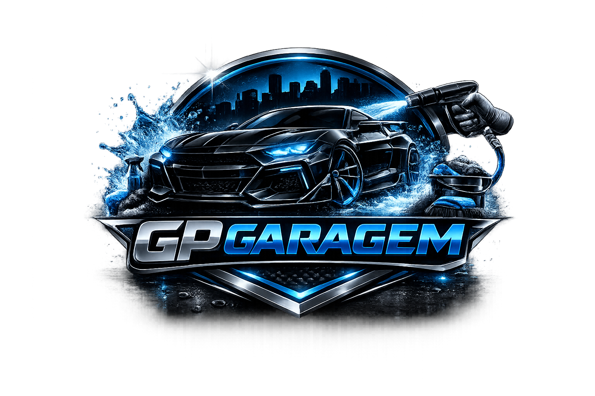

  

<h3>GP Garagem - Estética Automotiva</h3>

Uma One Page responsiva desenvolvida para serviços de estética automotiva. O projeto foca em uma interface "Dark Mode" elegante com detalhes em azul vibrante, garantindo uma experiência visual para o cliente.

---

## ✨ Demonstração Visual

O projeto conta com seções completas para apresentar o negócio:

* **Home:** Impacto visual com CTA para agendamento.
* **Serviços:** Cards detalhados com ícones e imagens.
* **Tabela de Preços:** Planos categorizados com destaque para o "Mais Popular".
* **Contato:** Informações essenciais de localização, horário e redes sociais.
* **WhatsApp Flutuante:** Botão fixo com animação de pulso para conversão imediata.

---

## 🚀 Tecnologias Utilizadas

Este projeto foi construído utilizando as melhores tecnologias do ecossistema Front-end:

- [React.js](https://reactjs.org/) - Biblioteca para construção da interface.
- [Vite](https://vitejs.dev/) - Ferramenta de build ultra-rápida.
- [React Icons](https://react-icons.github.io/react-icons/) - Conjunto de ícones profissionais.
- [CSS3](https://developer.mozilla.org/pt-BR/docs/Web/CSS) - Estilização personalizada com variáveis e animações.
